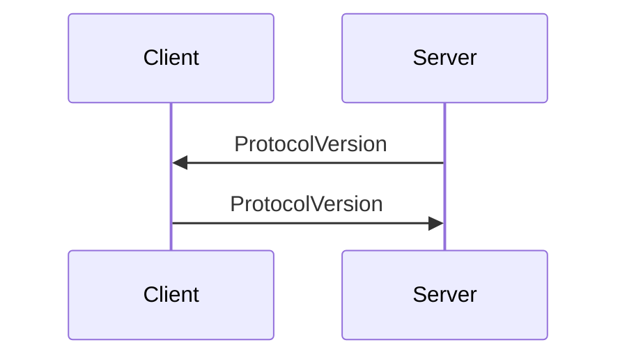

# 生命周期

RFB 协议分为握手和交换两个阶段，握手阶段包含协议版本握手和安全握手；交换分为初始化和帧交换。

- 协议版本握手
- 安全握手
- 帧交换

## 协议版本握手

连接建立后，服务器首先向客户端发送版本 X，收到 X 后，客户端向服务器发送不高于 X 的版本 Y。

X/Y 有三个公开可选版本 3.3/3.7/3.8，部分客户端或浏览器变种可能会发送其他的协议版本，统一将非标协议认定为 3.3（协议认为未公开协议版本没有实现3.7/3.8 中引入的特殊握手流程）。



协议消息由标识符、主次版本组成，其结构体如下：

```
  +--------------+--------------+--------------+
  | No. of bytes | Type [Value] | Description  |
  +--------------+--------------+--------------+
  | 3            | U8 array     | protocol     |
  | 1            | U8 [32]      | blank        |
  | 3            | U8 array     | major version|
  | 1            | U8 [42]      | pot          |
  | 3            | U8 array     | minor version|
  +--------------+--------------+--------------+
```

对于 3.8 版本协议，其发送协议头部如下：

```
RFB 003.008\n (hex 52 46 42 20 30 30 33 2e 30 30 38 0a)
```

## 安全握手

选定协议版本后，服务端和客户端继续交换所支持的认证方式。标准提供 None 和 VNC Auth 两种认证方式，如果客户端和服务端支持拓展加密协议，允许在交换安全协议后，继续交互数据包，完成认证过程。

- None: 不需要认证
- VNC Auth: VNC 鉴权

### VNC Auth

VNC Auth 是规范提供的加密方式。服务端首先向客户端发送长度为 16 字节的随机数据包，由客户端使用密钥加密后提交给服务器验证。

VNC Auth 使用零知识证明，保证密钥不会经由网络传输，防止可能存在的链路监听。